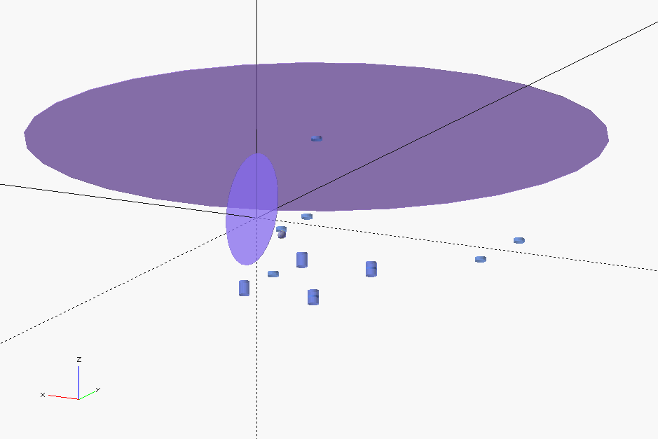

# YASim2SCAD

FlightGear YASim model visualizer for OpenSCAD. This code is intended to display [YASim elements](http://wiki.flightgear.org/YASim) as overlay to [OpenSCAD](https://www.openscad.org/) model.  It can be also used in the [FreeCAD](https://www.freecadweb.org/) using the [OpenSCAD import feature](https://wiki.freecadweb.org/Import_OpenSCAD_code).

The example example-yasim.xml file could be converted to OpenSCAD file by runnig:

```
python yasim2scad.py example-yasim.xml example-openscad.scad
```
Then the generated example-openscad.scad file should be opened in OpenSCAD as standard project file.




Copyright [ThunderFly s.r.o.](https://www.thunderfly.cz/)
